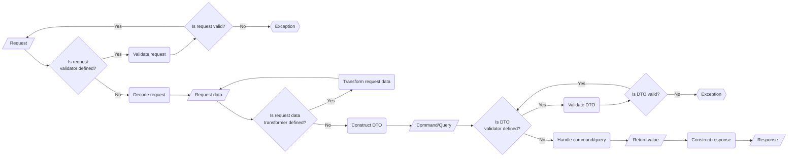

# Process

This is the outline of what the controller does:

## Component usage description

The following is a description of what the components are, for what they're being used and when they must not be used.

### Request validator

A request validator is there to validate information that is only accessible from the request itself and will not be part of the DTO or must be validated before a DTO is constructed from the request data. This could include headers of a request or validation of data on an application level. For example to scan uploaded files against viruses.

Multiple request validators can be applied on each request.

**It must not be used to:**

- Validate request content according to business rules.
- Validate the existence of content that is needed for construction of command or query objects. That must be handled in the DTO constructor.

[Request validator examples](./examples/request-validator.md)

### Request decoder

The request decoder takes the request object and turns its content into request data in form of an array. It doesn't matter how this data is collected. It might be GET parameters, the body as JSON or files as part of the request.

**It must not be used to:**

- Validate the request in any way.

[Request decoder examples](./examples/request-decoder.md)

### Request data transformer

The data transformer can have three kinds of tasks and multiple data transformers can be used with one request.

- Cast existing data into other formats.
- Sanitize existing data.
- Add additional data not present in the request.

**It must not be used to:**

- Validate the request data in any way. That must be handled in the DTO validator.

[Request data transformer examples](./examples/request-data-transformer.md)

### DTO constructor

The DTO constructor is there to construct the command or query from the request data. It also has to throw exceptions when there is data missing. Depending on the implementation that might already be handled by the hydration method.

[DTO constructor examples](./examples/dto-constructor.md)

### DTO validator

DTO validators are there to validate data within the DTO against information on an application and infrastructure level.

Multiple DTO validators can be applied on each request.

**It must not be used to:**

- Validate the integrity of the DTO itself
- Validate any of the value objects in it (that's the task of the constructors). 
- Validate any kind of business logic including access validation.

[DTO validator examples](./examples/dto-validator.md)

### Handler

The handlers are now freed to only concern themselves with the business logic. They receive either a command or query, but only the query returns a result which is later converted into a response.

**It must not be used to:**

- Access the request.

[Handler examples](./examples/handler.md)

### Handler wrapper

Handler wrappers are components that allow execution of code before (`prepare`), after success (`then`) and after error (`catch`) of a handler. Each method has its own priority with which it's executed in relation to other handler wrappers. Through this priority it's possible to have the `prepare` method be called first for one handler wrapper but the `catch` method be triggered last. This way it's possible to configure a `prepare` method of TransactionWrapper to be executed *before* the method for the LockWrapper, but have the `catch` method of TransactionWrapper be triggered *after* the method of LockWrapper. The priority mirrors the event listener logic from Symfony in that it's `0` as default and can usually range from `-256` to `256`.

With handle wrappers it's possible to implement automatic transaction rollbacks, locking of requests or silent exceptions. All things that are generally part of an application layer and not part of the domain.

For now there are no built-in handler wrappers because they are highly dependant of the domain implementation and / or depend on external libraries.

**It must not be used to:**

- Handle any kind of business logic.

[Handler wrapper examples](./examples/handler-wrapper.md)

### Response constructor

A response constructor is there to construct a response from the data that is returned from the handler. A command handler won't return anything. Therefore, most of the time a response handler like the `EmptyResponseConstructor` will be configured for it.

The query handler on the other hand will return a value nearly every time and depending on the use case, the value might be serialized to JSON, send as binary data or even be streamed as part of a streamed response.

[Response constructor examples](./examples/response-constructor.md)
