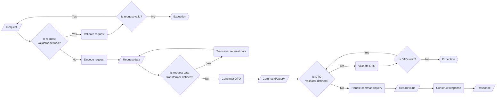

# Process

```mermaid
graph LR;
    Request[/Request/] --> IsRequestValidatorDefined{Is request <br>validator defined?}
    
    IsRequestValidatorDefined -- Yes --> ValidateRequest(Validate request)
    ValidateRequest --> IsRequestValid{Is request valid?}
    IsRequestValid -- Yes --> Request
    IsRequestValid -- No --> RequestValidationException{{Exception}}
    IsRequestValidatorDefined -- No --> DecodeRequest(Decode request)

    DecodeRequest --> RequestData[/Request data/]

    RequestData --> IsRequestDataTransformationDefined{Is request data<br>transformer defined?}
    IsRequestDataTransformationDefined -- Yes --> TransformRequestData(Transform request data)
    TransformRequestData --> RequestData
    
    IsRequestDataTransformationDefined -- No --> ConstructDTO(Construct DTO)
    ConstructDTO --> DTO[/"Command/Query"/]

    DTO --> IsDTOValidatorDefined{Is DTO<br> validator defined?}
    IsDTOValidatorDefined -- Yes --> ValidateDTO(Validate DTO)

    ValidateDTO --> IsDTOValid{Is DTO valid?}
    IsDTOValid -- No --> DTOValidationException{{Exception}}
    IsDTOValid -- Yes --> IsDTOValidatorDefined

    IsDTOValidatorDefined -- No --> Handle(Handle command/query)

    Handle --> ReturnValue[/Return value/]

    ReturnValue --> ConstructResponse(Construct response)

    ConstructResponse --> Response[/Response/]
```
