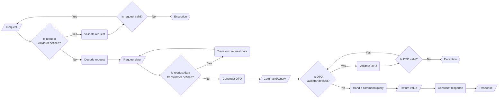

# Process

This is the outline of what the controller does:

## Component usage description

### Request validator

A request validator is there to validate information that is only accessible from the request itself and will not be part of the DTO or must be validated before a DTO is constructed from the request data. This could include headers of a request or validation of data on an application level. For example to scan uploaded files against viruses.

It must not be used to:

- Validate request content according to business rules.
- Validate the existence of content that is needed for construction of command or query objects. That must be handled in the [DTO constructor](./dto-constructor.md).

### Request decoder

The request decoder takes the request object and turns its content into request data in form of an array. It doesn't matter how this data is collected. It might be GET parameters, the body as JSON or files as part of the request.

It must not be used to:

- Validate the request in any way.
